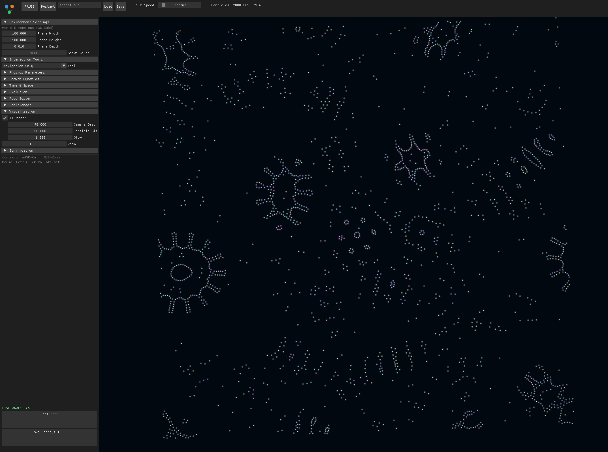
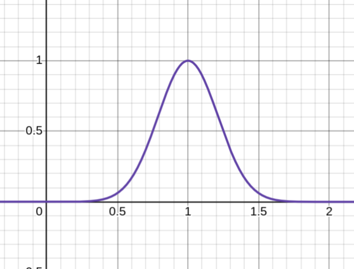
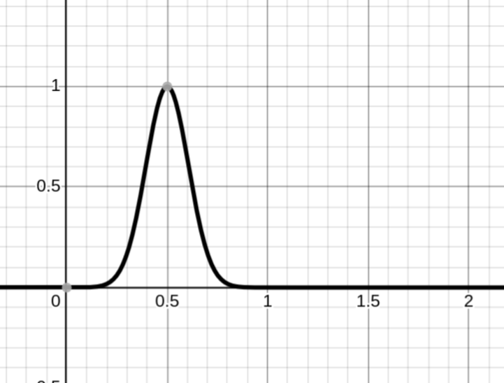
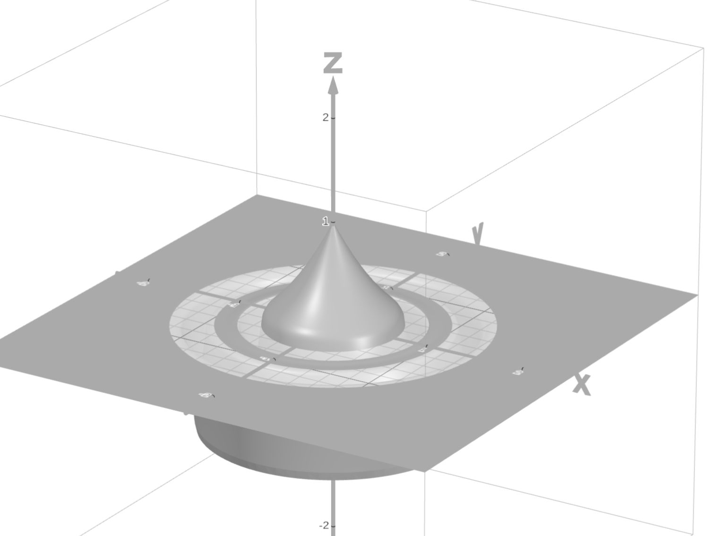

# HyprLenia

**A hyper-optimised sandbox for real-time 3D emergent behaviour**


---

## What We Built

HyprLenia is the first real-time 3D emergent behaviour sandbox. It extends Conway's game of life to have continuous time, continuous state, and continuous space.

We define the laws of physics through mathematical functions: a sensing kernel, a growth function, and a repulsion field. These combine into an energy landscape. Particles then update their positions via gradient descent on this landscape, each one rolling downhill toward lower energy.

The simulation runs entirely on the GPU. Tiled shared memory reduces global memory bandwidth by 128×. Spatial hashing drops complexity from O(N²) to O(N × k). The result: a responsive research tool where you can tweak parameters and immediately see how emergent behaviours change.


---

## The Problem

Conway's Game of Life showed that complex patterns can emerge from trivial rules. But it's locked in a grid: discrete cells, discrete time, discrete neighbours.

Particle Lenia breaks free. Particles float in continuous 3D space, carry continuous energy values, and sense their surroundings through smooth mathematical kernels. The result: particles spontaneously organise into stable clusters, moving creatures and complex emergent behaviour. All from 3 simple rules.

---

## Emergent Behaviours

Each particle follows three rules:

1. Sense neighbours using a ring-shaped kernel
2. Evaluate whether local density is optimal
3. Move downhill on the energy landscape

From this, we observe:

- **Stable Clusters**: Particles naturally form cohesive groups
- **Locomotion**: Some configurations traverse the world
- **Reproduction**: Successful particles spawn offspring
- **Food Ecosystems**: Particles forage, compete, and evolve




---

## The Core Insight

Each particle greedily minimises its own free energy, not the system's total energy. This distinction matters.

Global energy minimisation produces boring outcomes. The system settles into static equilibrium. Particles clump together or spread uniformly. Nothing moves.

Local energy minimisation produces complexity. Each particle selfishly seeks its optimal neighbourhood, but these local decisions create global patterns that never settle. Rotating clusters, travelling waves, self-sustaining structures.

This reflects a deep principle in physics: life exists far from equilibrium. Living systems maintain dynamic steady states through constant local optimisation.

---

## GPU Optimisations

### Tiled Compute Shaders

The naive approach checks every particle against every other: O(N²). We use tiled computation with shared memory. Particles are processed in groups of 128, with each tile loaded into fast on-chip memory before computing interactions.

```glsl
shared vec4 tileData[128];  // xyz = position, w = energy

int loadIdx = t * 128 + int(localIdx);
tileData[localIdx] = vec4(particlesIn[loadBase], ...);
barrier();

for (int j = 0; j < tileEnd; j++) {
    vec3 otherPos = tileData[j].xyz;
    // compute interaction
}
```

This reduces global memory bandwidth by 128×.

### Spatial Hashing

For larger particle counts, grid-based spatial hashing reduces complexity to O(N × k) where k is particles per cell neighbourhood. Only nearby cells are checked.

### Finite Difference Gradients

Rather than computing ∇E analytically, we sample energy at 6 neighbouring points and use central differences:

```glsl
float E_xp = computeE(posXp);
float E_xn = computeE(posXn);
gradE.x = (E_xp - E_xn) / (2.0 * h);
```

### Double Buffering

Two particle buffers swap each frame for fully parallel reads and writes without synchronisation hazards.

---

## The Mathematics

| Aspect | Game of Life | Particle Lenia |
|--------|--------------|----------------|
| **State** | 0 or 1 | Continuous [0, 1] |
| **Time** | Discrete ticks | Continuous (small dt) |
| **Neighbours** | 8 adjacent cells | Smooth kernel over distance |

### Sensing Kernel K(r)

A Gaussian shell peaking at distance μ, not at the centre:

$$K(r) = w_k \cdot \exp\left(-\frac{(r - \mu_k)^2}{\sigma_k^2}\right)$$



### Density Field U(x)

$$U(\mathbf{x}) = \sum_i K(\|\mathbf{x} - \mathbf{p}_i\|)$$

### Growth Function G(U)

$$G(U) = \exp\left(-\frac{(U - \mu_G)^2}{\sigma_G^2}\right)$$



### Repulsion R(r)

$$R(r) = \frac{c_{rep}}{2} \cdot \max(1 - r, 0)^2$$


### Energy E(x)

$$E(\mathbf{x}) = R(\mathbf{x}) - G(U(\mathbf{x}))$$




### Update Rule

$$\frac{d\mathbf{x}}{dt} = -\nabla E$$

---

## Technology

| Component | Stack |
|-----------|-------|
| **Simulation** | OpenGL 4.6 Compute Shaders |
| **Rendering** | OpenGL 4.6, point sprites |
| **Interface** | Dear ImGui |
| **Build** | CMake |

---

## Build

```bash
git clone https://github.com/ron0studios/lenia3d.git
cd lenia3d/hyprlenia
cmake -B build .
cmake --build build
./build/particle_lenia
```

**Controls**: WASD rotate, Q/E zoom, Space pause.

---

## Credits

- [OpenGL](https://www.opengl.org/)
- [Dear ImGui](https://github.com/ocornut/imgui)
- [Lenia Breeder](https://leniabreeder.github.io/)
- [Particle Lenia Research](https://google-research.github.io/self-organising-systems/particle-lenia/)
